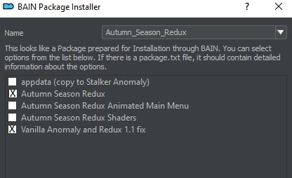

If you want to mod the game yourself a bit more, you need to better understand how MO2 works. You can read this to get some information about MO2 https://anomalymodding.blogspot.com/2021/04/Mod-Organizer-2-setup-and-Amomaly-modding-guide.html

# HD models

If you want HD Models rather than DICK and FVM (which are much better imho).

HD models are bad for a number of reason: bad normal maps, i.e. flat looking textures and bad reaction to environmental lightning. They can also greatly affect your performances in certain areas. Their diversity is also not good compared to DICK which includes 3000+ models, i.e. almost one unique model per NPC in the Zone. That is why I do not recommend HD models.

If you still want it:

1. Untick the following add-ons:
   - Dux Innumerable Characters Kit
   - Fixed Vanilla Models
   - DICK Black Jack patch
   - Cr3pis icons helmetless armors
   - Better portraits icons
   - GAMMA Better Merc voices

2. Download HD models here https://www.moddb.com/mods/stalker-anomaly/addons/anomaly-hd-models-addon

3. Download this patch https://www.moddb.com/mods/stalker-anomaly/addons/gamma-and-hd-npc-models-compatibility-patch

4. In MO2, press Ctrl+M on your keyboard and show the HD models archive. Do the same for the compatibility patch. Move both new addons to the bottom of the load order in MO2 and tick them.

5. In MO2, right click GBOOBS BWRR patch - Grokitach and click Reinstall mod. Select GBOOBS Patches and tick BWRR patch as well as HD models patch. 

# Yet Another Winter Mod

If you want to use Yet Another Winter Mod:

https://www.moddb.com/mods/stalker-anomaly/addons/yet-another-winter-mod-21-rc-18

it should be loaded before Enhanced Shaders (under visual). Disable Agressor in MO2. 

# Classic Textures

If you have a potato PC, install this and disable Agressor add-on in MO2.

https://www.moddb.com/mods/stalker-anomaly/addons/classic-textures-151

# No grass or LODs

This is a good performance addon and will help making Yet Another Winter Mod looking perhaps better.

https://www.moddb.com/mods/stalker-anomaly/addons/no-grass-and-lods-great-for-winter-mods-and-potatoes 

# Winter - Project INVERNO
By Fabio Conte: https://www.moddb.com/members/pab1oescobar

Project INVERNO works right off the bat with GAMMA.

Simply disable Gardener of the Zone and Simple Autumn Retexture (No Leaves) and Grulags Bushes are Dead add-ons and load (Ctrl+M > indicate the addon archive) Project INVERNO Just BEFORE/ABOVE  Particles Cinematic VFX3.5 1.1.2 BOTZ YAWM (this includes particles necessary for inverno to work).

DO NOT USE the shaders pack from this folder

https://www.moddb.com/mods/stalker-anomaly/addons/project-inverno1/#8431612 

# Dead Zone: Autumn Season Redux
By Fabio Conte https://www.moddb.com/members/pab1oescobar

For a very grim looking zone, you can try out this pack. Simply disable Gardener of the Zone and Simple Autumn Retexture (No Leaves) add-ons. Then load this texture pack and place it just BEFORE/ABOVE Particles Cinematic VFX3.5 1.1.2 BOTZ YAWM

DO NOT USE the shaders pack from this folder
https://drive.google.com/drive/folders/1jCAlpa5DnN7EADkAcCQVQ1HTo9CdjTt7

When asked, select Autumn Season Redux + Vanilla Anomaly and Redux 1.1 fix (check pic)

# Summer
By: Fabio Conte https://www.moddb.com/members/pab1oescobar

For a florishing looking zone, you can try out this pack. Simply disable Gardener of the Zone and Simple Autumn Retexture (No Leaves) add-ons. Then load this texture pack and place it just BEFORE/ABOVE Particles Cinematic VFX3.5 1.1.2 BOTZ YAWM

DO NOT USE the shaders pack from this folder
https://drive.google.com/drive/folders/1jCAlpa5DnN7EADkAcCQVQ1HTo9CdjTt7 

# Autumn: Golden Autumn Redux
By: Fabio Conte https://www.moddb.com/members/pab1oescobar

For a bright looking zone, you can try out this pack. Simply disable Gardener of the Zone and Simple Autumn Retexture (No Leaves) add-ons. Then load this texture pack and place it just BEFORE/ABOVE Particles Cinematic VFX3.5 1.1.2 BOTZ YAWM

DO NOT USE the shaders pack from this folder
https://drive.google.com/drive/folders/1jCAlpa5DnN7EADkAcCQVQ1HTo9CdjTt7 

# Alternative looking Dead Zone

Please follow the install instructions detailed in the addon page for GAMMA

https://discord.gg/wJ48RNPqN5 

# Frozen Zone

Install instructions in the addon page for GAMMA

https://discord.gg/wJ48RNPqN5 
