Good playlist with lots of guide with many questions answered: https://youtube.com/playlist?list=PLDPlbMWnulB7HPaghsAujILtFACnpt_w1

# FULL G.A.M.M.A. INSTALLATION or ONLY INSTALL G.A.M.M.A. ADDONS?

## Full G.A.M.M.A. installation install and update everything. Simple as that.

This option will re-install G.A.M.M.A (yes, it's expected) and, at the same time, will check if there are new updates for every mod already installed, so if any mod gets an update, you'll get the update.

And yes, it's slower, but it's normal since you're basically installing everything again + checking if something have an update.

**WARNING: DON'T ABUSE this option, it scans Moddb for mods and updates, you CAN and WILL be flagged as a bot.**

If you get flagged, it's temporary, don't worry about it. You can always use a VPN.

## Only install G.A.M.M.A. Addons

It's mostly for hotfixes or little changes.

This is obviously faster because it doesn't have the need to check 330+ mods.

## Do I need to click BOTH when I want to install for the first time/update?

**NO, YOU DON'T NEED TO DO THAT.**

It really only depends on what you want to do. So ask yourself this:

"Do I want to update everything and be sure about it?" -> Full G.A.M.M.A. installation

"I don't want to wait X hours, minutes and seconds just to update everything..." -> Only install G.A.M.M.A. Addons

Or maybe, because who knows: "I don't want to do anything at all, my game works just fine and I'm happy with what I have right now." -> Don't do it then!

As long as everything works for you, it's fine, you're not obligated to do anything, unless there is some serious bugs that need to be fixed and the fix have been found, in that case it's better to update.

Is there a fixed order for doing this?

1. Always Download G.A.M.M.A. data first
2. Since you know the difference now, it's up to you
3. Wait for the installer to be done
4. Play the game 

# Backup

## My user settings/my mods settings/my keybinds are constantly reset every time I update or do something and I'm tired of it, what can I do about it?

Concerning user settings, like keybinds or settings, you can make a backup of your user.ltx file that you can find in your Anomaly/appdata folder.

When you want to update (whether it is Full G.A.M.M.A. installation or Only install G.A.M.M.A. addons), take out this file and put it back in when you're done.

Concerning mods settings, you simply need to rename a mod called "G.A.M.M.A. MCM values - Rename to keep your personal changes" that you can find in your mod list.

REMOVE the "- Rename to keep your personal changes" part from the name of the mod, to turn it into "G.A.M.M.A. MCM values".

Simple as that.

Next time you'll update, you'll find two mods:

1. the one YOU renamed (G.A.M.M.A. MCM values) 
2. the old one with the full name (G.A.M.M.A. MCM values - Rename to keep your personal changes).

 If you can't find your renamed mod, check on the bottom of your mod list.

You'll just need to DISABLE the mod with the FULL NAME and ENABLE the mod with the RENAMED NAME. 

# Debug mode

1. Open MO2
2. Follow the pic: https://imgur.com/a/tZfTSQx
   In this case, DX11 is being used. If you don't use DX11, select another DX from the list on the left.

Fun fact: with Numpad 0 you can go in "noclip mode" and pressing Enter will teleport you wherever you want. 

# LAST DAWN: CAN'T FIND THE SCANNER FROM THE ANOMALY IN THE SOUTH WEST CORNER OF THE SWAMPS

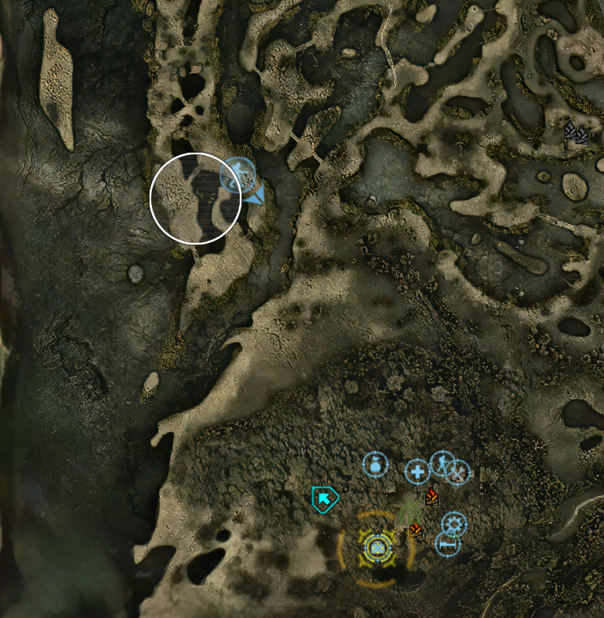

# HOW TO SEND YOUR MOD LIST

Open MO2, look for that icon (first pic), click on it, in the menu select "Export to csv" (second pic), do the following (third, fourth and fifth pic), save the file and send it where it was asked.

1. 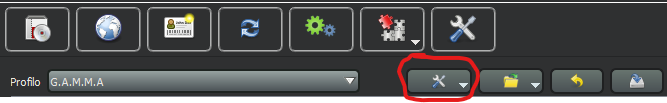
2. 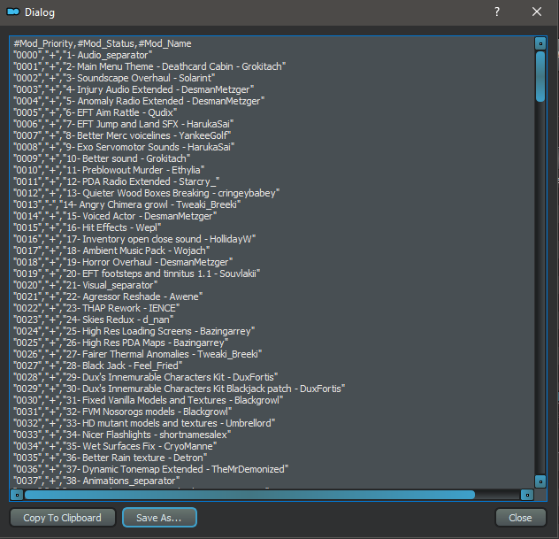

# I WANT TO DISABLE YACS BETTER CAMPFIRE SAVE BUT MY GAME KEEPS CRASHING, WHY?

1. Open G.A.M.M.A., when you reach the main menu, open Mod Configuration Menu, you can do it even before you load your save.
2. Scroll down to the bottom until you find YACS.
3. Disable "Enable Campfire Saving".

KEEP IN MIND that re-installing or updating G.A.M.M.A. bring your mod list back to "default", deleting every change you did to your mod list. Simply put, if you disable YACS and then you update, you'll have to disable YACS again.

Since this mod is handled by MCM, you can keep this choice by doing this: [Backup](#backup) 

# I WANT TO ACTIVATE TRADER OVERHAUL BUT I’M NOT SURE WHAT IT DOES EXACTLY AND FOR SOME REASON I BELIEVE I CAN BUY GUNS AND ARMORS

Trader Overhaul (TO) is a massive mod, which, in essence, overhauls the inventory and progression of almost all traders in game. Since G.A.M.M.A. has it’s own Economy system in place, you might wonder how they will work together.

There's no need to create a new save but you will have to wait for the next restock cycle, these changes aren't instant.

This is a list of changes, which TO will make, when activated in G.A.M.M.A.:

- Sidorovich: Now sells a wider selection of ammo and attachments.
- Barkeep: Now sells ammo, low lvl gun attachments in addition to food, as well as low lvl tech items. Basically a bit of everything.
- Cashier: Now sells more high tier ammo and attachments.
- Meeker: Similar to Cashier.
- Forester: has his own unique stock, mostly high tier mutant hunting gear.
- Bandit traders received own unique stock as well (UNTESTED).
- Beard is more of an allrounder now (similar to Barkeep).

More traders sell junk items now (pretty expensive though).

TL;DR if you can't be bothered to read the changes:

It overhauls useless traders, like Barkeep and Beard, to be more useful while expanding the inventory of most others. It will NOT revert the changes made by G.A.M.M.A. Economy. You still won’t be able to buy or sell guns and armor and random stalker won’t trade with you. There's no need to create a new save but you will have to wait for the next restock cycle, these changes aren't instant.

If you play WITHOUT G.A.M.M.A. Economy, you can simply refer to the description of the mod for its changes, here: https://www.moddb.com/mods/stalker-anomaly/addons/trader-overhaul-complete

# I WANT TO BE ABLE TO BUY AND SELL GUNS AND ARMOR

PLEASE NOTE: This will remove an integral part of the G.A.M.M.A. experience, and it is strongly recommended to try out the new system before going for this (radical) solution.

In G.A.M.M.A., you cannot buy or sell guns and armor suits. Furthermore, the supply levels at which specific gun attachments appear have been changed as well.

In case this seems to harsh for you, you can revert these changes by doing the following:

1) Disable G.A.M.M.A. Economy
2) Disable G.A.M.M.A. Economy no BAS injection 

# I'M IN GAME BUT I CAN'T SEE ANYTHING, IT'S ALL BLACK/DARK/WHITE/GREY

First of all, Anomaly 1.5.2 is REQUIRED. IT'S OBLIGATORY. 1.5.1 DOESN'T WORK ANYMORE.

Also, DON'T disable Shader Based Scopes shaders, YOU NEED THEM.

1) Make 100% sure you're launching Anomaly FROM MO2. Launching Anomaly using the Anomaly Launcher in the Anomaly folder (that's a mouthful) will result in a black screen.
   
   Simply put, be absolutely sure that you're not playing with Anomaly vanilla.
   
   Especially, don't launch the game using "Anomaly Launcher", use DX11/10/8.

2) Didn't work?
   
   Try to delete a folder called shaders_cache, you can find it in Anomaly\appdata.

3) Still nothing?
   
   Try this other method:
   
   When you're in game, open the command console with \ and type: cfg_load grading_warm

4) Still black?
   Try this desperate method:
   - Go in GAMMA RC3\.Grok's Modpack Installer\G.A.M.M.A\modpack_patches\appdata
   - Copy the user.ltx file you'll find in there (note that every change made by you in your user.ltx will be reverted to default
   - Paste this file in Anomaly\appdata

5) Nothing even with all of this?
   - Make sure you have the latest version of the installer: 3.8. (If you don't have it, grab it here: https://discord.com/channels/912320241713958912/912827116427554877/1026047157851127838)
   - Run the installer as admin
   - Download GAMMA data, wait for it to finish, and then click on Full GAMMA installation

# LAST DAWN: SEARCH FOR THE MISSING SCOUT

WARNING: this quest can fail if you don't do it the moment you get it, because it's timed, so yes, you NEED to do it AT NIGHT. You need to loot the PDA BEFORE daytime and take it to Spore.

## Can I save the scout?

NO, YOU CAN'T save the scout. You'll ALWAYS find him dead.

If you fail this quest due to lack of time, YOU CAN STILL GO GET THE PDA and take it to Spore. The body doesn't despawn until looted and it will resets the quest.

You'll get a notification on PDA/Radio later on from Spore about the PDA being decrypted.

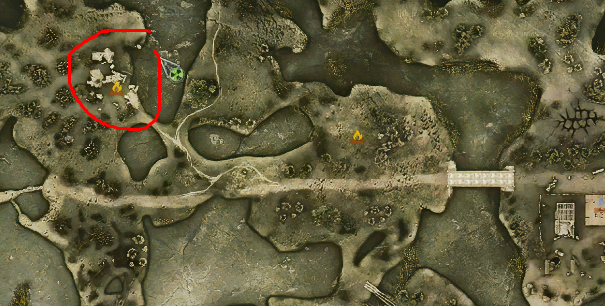


# OKAY SO, MY GUN JUST SUCK! HOW DO I FIX IT!?


# I FOUND AN OUTFIT, BUT IT SUCKS CUZ I CAN'T REPAIR IT!!


# How to fix emissions not happening anymore

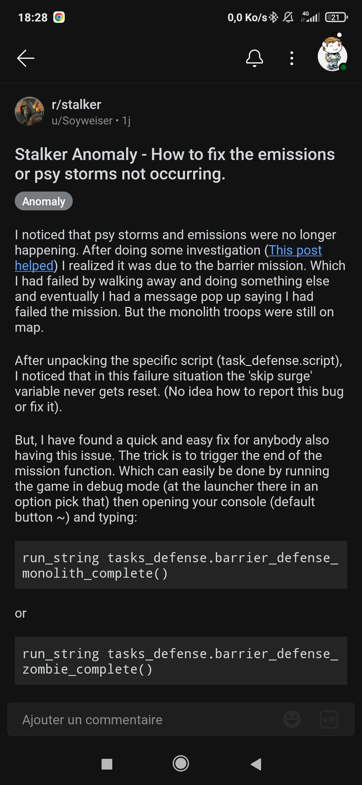

# CRASHING WITH AMD GPU

This is a "collection" of possible, I repeat, possible solutions regarding the various crashes you may experience using an AMD GPU.

These are reports from various users who also have an AMD GPU and who, thanks to these fixes, were able to solve their problem.

Therefore, we cannot guarantee that they will work; they worked for them but this does not mean that they will work for you.

- Start by putting your Anomaly and GAMMA folder in your antivirus exceptions. (the image is an example of what you should put in the exceptions)
- If you believe that any files have been deleted, the general advice is to delete everything and repeat the Full G.A.M.M.A. Installation. You will need to delete both the Anomaly and GAMMA folders.
  
  **WARNING: BEFORE** deleting the folder containing GAMMA, move the "downloads" folder you will find inside, to a safe location. That folder contains all the mods that GAMMA downloads and installs for you. **DO NOT DELETE IT.**
- Disable steep parallax
- Fix about the "AMD GPU hardware block": Go into the Anomaly folder and force both directx11.exe to launch with admin rights, go into Properties, disable "Full screen optimization" and enable "DPI overrule".
- Follow this: [TROUBLESHOOTING.md#gpu-device-instance-has-been-suspended-fix](./TROUBLESHOOTING.md#gpu-device-instance-has-been-suspended-fix) 

# I NEED TO COMPLETE A FAILED QUEST/I NEED TO DO SOMETHING WITH THE CONSOLE

1) Enable debug mode (check pins to learn how)
2) Get the task_id from the ltx files of the game
3) Press F7
4) Click the NPC Logic/Execute button (check pic)
5) Copy paste this command line: task_manager.get_task_manager():set_task_completed("task_id")
6) Replace task_id with the actual task_id you need

We also have a readme: [quest-completion.pdf](./assets/quest-completion.pdf)

# I'VE UPDATED GAMMA BUT NOW I CAN'T RUN IT ANYMORE, IT CRASHES WHEN I LOAD MY SAVE

Maybe you're using some optional mod that "sticks" to that specific save.

Unfortunately you can't disable these mods in the middle of your run, you either finish with those mods or you start a new game without them.

These below are the known mods that you CAN'T disable in an ongoing run:

- Mags Redux, you CAN'T load a save without this mod, it WILL crash because the game cannot find what was added by the mod.
- ANUS (yeah I know, I'm serious :kekleo:), the only thing it messes up are names, the save itself should be safe.
- Body Awareness, but for this one there's a catch: you can disable it in game through MCM Settings, not from MO2. 

# HOW TO REPAIR AND MAINTAIN GUNS AND ARMORS 

https://www.youtube.com/watch?v=oohStQHPsfk 

# BASIC HEALING

https://youtu.be/hs9H28oP_f4 

# CRASHING ON TRANSITION OR FAST TRAVEL TO A CERTAIN LOCATION OR FROM A CERTAIN LOCATION

1) Save your game
2) Enable debug mode (click here and learn how: [Debug mode](#debug-mode))
3) Press F7 in-game to open debug
4) Delete common squads
5) Sleep 48 hours (you can use sleeping pills, smoke some pot or drink vodka to get sleepy)
6) Try transitioning/fast travel 

# A LITTLE SOMETHING ABOUT PROGRESSION, PT.1 - TOOLKITS

When it comes to toolkits or detectors, especially toolkits, there is always some confusion, both for old players and new ones, because crafting is a mechanic that in Anomaly is never touched, it is useless, it makes little sense.

GAMMA, on the other hand, takes the mechanics in stride and makes it vital, important, rewarding and other adjectives that make it intriguing.

So, what exactly do you need in order to do... stuff?

You need to find basic, advanced and expert toolkits in order to be able to craft/repair/maintain everything. Putting it on a "progression perspective", Basic and Advanced are for early/mid game, Expert are for end game.

- In the south part of the Zone (everywhere under Red Forest) is where you'll find Basic and Advanced.
- In the north part of the Zone, basically from Red Forest and north from there, is where you'll find Expert tools.
- You also have the gunsmithing toolkit, which is used to craft ammunition of all kinds and you also have the drug making kit, used to create drugs and medicines.
- You can find all these tools inside stashes, the difference is in "where" you look for them. It is also a matter of RNG and luck. Imagine a pool with these toolkits inside, the RNG will take one of these items and put it in the stash.

Depending on the location, north or south:

- White stashes have a small chance of finding ANY toolkit inside, this means that you can find ONE basic/advanced/expert toolkit OR a gunsmithing toolkit OR a drug making toolkit.
- Green stashes have a 100% chance of finding ONE toolkit inside from that pool, so it could be anything, but you'll always find one, guaranteed.

Tip: since it can be difficult to find them, you can create an "Advanced Toolkit" with 5 Basic toolkits, if you already have a basic tool kit to use (obviously). 

# A LITTLE SOMETHING ABOUT PROGRESSION, PT.2 - DETECTORS

Speaking of detectors, the progression lies in what artefacts you can find and "see" with each of them. For example, the first one (Echo) detects only few of them, so basically, the more "powerful" your detector is, the more artefacts you can "see" with it.

This should be the order, hoping I'm not missing one or messing up names:

1) Echo - Very simple, very limited, cannot detect a large amount of artifacts. It possesses an intermittent light and a "beep" sound that, when in the vicinity of an artifact, gets louder and louder as you get closer to it.
2) Bear - You can see the direction in which the artefact is because of its display; this detector also has a beep, as you get closer it gets louder and louder.
   - Grizzly - It is almost identical to the Bear detector in terms of its "look", its function is also the same, you have a display and the artefact direction. The main difference is that it detects every possible artifact that can be found in the Zone and can be also be used with NVGs at night.
3) Veles - The position of artefacts is shown on its display.
4) Svarog - It's like an "update" for the Veles but you can see artefacts AND anomalies with it, simply the best. (now you can also see DAO's anomalies as well with it) 

# A LITTLE SOMETHING ABOUT PROGRESSION, PT.3 - FOOD AND HOW TO COOK IT

In early game, money at our disposal is tight, if we can save something it's always better, also because medicines are expensive and we cannot craft water yet.

Why not start by not buying canned food or MRE?

GAMMA has a new cooking system, now eating mutant meat is convenient and useful, it gives buffs and it keeps your stomach full much longer than a can of beans or a MRE.

Let's start by talking about what you need to use and how.

We have two kits at our disposal that we can use for cooking: Field Cooking Kit and Multi-fuel stove.

Both have a specific use, different types of combustible and water/vodka to be used to "purify" the meat.

Depending on the kit used, you have three ways to cook and (in case) purify the meat:
- Directly "over the fire" without using water or vodka (Zone-produced - less kcal, slightly less radiations, increased sleepiness)
- Make a stew using water (Stewed - more kcal, less radiations, increased sleepiness)
- Purified, by using vodka (no defects, gives buffs)

The Field Cooking Kit ONLY works with charcoal, which means you CAN also use a campfire. Just walk up to one and when you click on the kit, it will open a menu where you can choose what to cook.

This kit allow you to cook only certain types of meat that come from lesser mutants. It does not allow you to thoroughly "purify" the meat but makes it "stew" by using water and consequently removing some of the radiations.

Multi-fuel stove CANNOT use fire as fuel and needs Kerosene, gasoline or natural gas.

It's more expensive in terms of combustible but allows you to cook all kinds of meat you can find in the Zone, as you wish. Purified meat has no defects, keeps you fuller and depending on the type of mutant you cook, also gives very useful buffs.

Tips: use canteens when you use water, not bottled. Buy a Multi-fuel stove from Butcher (or craft it).

# A LITTLE SOMETHING ABOUT PROGRESSION, PT.4 - ARTEFACTS

G.A.M.M.A. have a new artefacts spawning system, they can spawn randomly in the current map the player is in, in anomalous fields and laboratories.

Artefacts will spawn with a random low condition (or "quality") to mimic that every artefact is different in their strength, reducing drastically the possibility to sell them at 100% condition, making progression much longer.

This doesn't mean you can't get 100% artifacts at all. Let me introduce an exclusive new toolkit only available in G.A.M.M.A.: The Artefact Melter™️, buyable from Sakharov or Herman's for about 30k RU.

The Artefact Melter™️ works like a toolkit, you can access its crafting menu as you do with all toolkits. You can craft artefacts (Right click -> Fuse artefacts) and empower them (Right click -> Empower artefacts).

Every action you take with the Artefact Melter™️ will consume some uses. You can refill the melter by holding down Left-Alt key and dragging it over any artifact. This will melt the artefact you chose and will give one additional use to the melter.

You can alternatively buy another melter or you can bring one with you in the Zone, you can replenish it with artifacts you don't care about directly on the spot.

- Artefacts crafting: There will be a new crafting subsection, Artefacts. This will allow you to convert multiple artefacts of a given tier to the tier above:
  Junk -> Tier 1 (7mS), Tier 1 -> Tier 2 (12mS), Tier 2 -> Tier 3 (23mS), Tier 3 -> Special.

- Artefacts empowering: combine two exactly similar artefacts to sum their condition/quality. You can combine any junk artefact with any other junk artefact at a reduced rate.

Here you can find a spreadsheet listing the artifacts needed to create a given artifact: https://docs.google.com/spreadsheets/d/1a9TWVFTlFbxA8edwx-SZcLmyoywZ9TuFy0h-G56hdD0/edit#gid=0

# HOW TO GET RID OF THE STUCK TOOLTIP IN THE CRAFTING MENU

try changing between crafting categories or between the workbench tabs (see the video for explanation)

1. 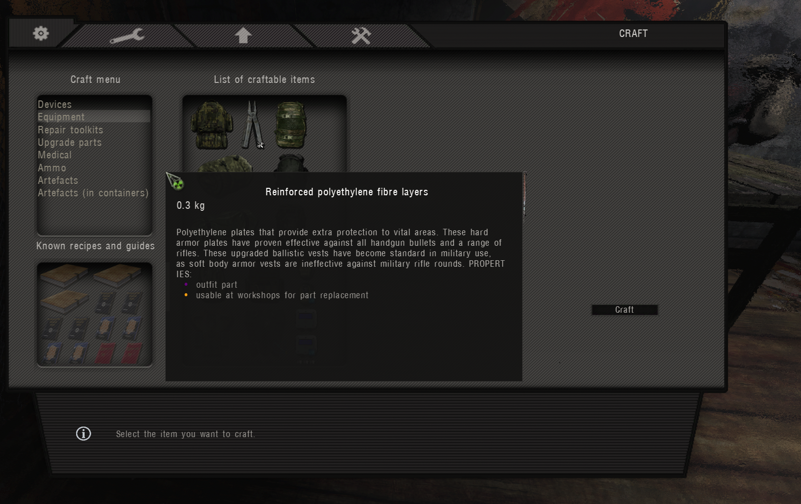
2. [video](./assets/stuck-tooltip-rid-2.mp4)

# HOW TO AVOID THE STUCK TOOLTIP IN THE CRAFTING MENU

keep the mouse in an empty spot of the crafting menu before closing it

[video](./assets/stuck-tooltip-avoid.mp4)

# IS THERE A WAY TO KEEP MY PERSONAL MOD CONFIGURATION BETWEEN UPDATES?

You can copy/clone your G.A.M.M.A. default mod list (look pic) by giving it another name, in this case it's called "G.A.M.M.A. Custom".

From now on, you can use this second mod list directly, every time you update G.A.M.M.A., the mods in the second list will also be updated, because, of course, they come from the default mod list.

The only "downside" is that any NEW mod that get added (or disabled/moved) in the future will always be put at the bottom of your second mod list.

In this case, you can just rely on the default mod list and move and, in case, enable the mods accordingly.

PS: since it can get confusing, "extra" mods added by you will always end up at the bottom of the original mod list.

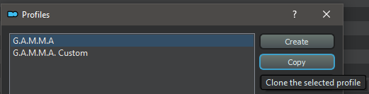

# I WANT TO SLEEP WHENEVER I WANT, I DON'T CARE IF IT ISN'T IMMERSIVE!!1! 

You can do that, BUT:

1) Make sure you NEVER TOUCH "sleep deprivation" OR (while I'm at it) "water deprivation" IN THE GAME OPTIONS.
   This basically destroy the whole game and your save, meaning you'll need to start a new one, so be careful.

2) Disable these mods in your mod list:
   - Immersive Sleep
   - FDDA Immersive Sleep Patch
   - G.A.M.M.A. Sleep Balance 

# MY GAME LOOKS BROWN AND THE ZONE IS DEAD, IT'S BEEN 84 YEARS FROM MY LAST UPDATE, WHAT'S GOING ON?

Grok has decided to make his vision of the Zone mandatory for everyone, activating by default certain mods that make everything "dead".

To return to the old version of the Zone, you simply have to disable these mods:

- Simple Autumn Retexture No leaves
- Gardener of the Zone Textures
- Grulag's Dead Bushes
- Autumn No Leaves LOD Fix

Suggestion/Tip/Warning:

If, and only if, you might want to re-enable G.A.M.M.A. NPCs cannot see through foliage, in this case I suggest to disable Weapon Cover Tilt, because this "foliage" mod makes bushes basically walls and the "tilt" mod sees them as such, making it almost impossible to hide and shoot inside them.

**KEEP ALSO IN MIND** that Weapon Cover Tilt is "tied" with Gunslinger Controller, meaning that you can't disable one without disabling the other.

To avoid a CTD, I recommend to disable the tilt mod directly from Mod Configuration Menu in game, without touching MO2, so you can keep everything else enabled. 

# GAMMA ON LINUX, POSSIBLE?

Right now I'm running it through Wine 7.2 on Lutris with these options. (see picture below)

Lutris is not needed but it helps a lot of newbies to set it up, it's the same that just using wine and winetricks

For the .dll needed to run the game, or at least what worked for me, using winetricks:
- cmd
- d3dcompiler_47 (should be enough but I got 43 installed too, just in case)
- d3dx11_43 and/or any DirectX version you want to play with
- dxvk for Vulkan translation from DirectX
- quartz
- vcrun2019 (should install all packages from 2015 to 2019)

For the installer, I was using a virtual machine running Windows 10 and it did the job, but theoretically installing dotnet from winetricks and Powershell on Linux should make it work .

Note from the author: "No way I could make it work with wine, either using wine-mono or dotnet dlls, if anyone finds a way to make it work, contact me."

Works with all DirectX versions EXCLUDING DX9 which doesn't work, don't even think about it.

Warfare Alife Overhaul now works but IN ANY CASE it's not recommended to play with GAMMA.

See https://github.com/DravenusRex/stalker-gamma-linux-guide

# I CAN'T FIND ANY OUTFITS FROM MY OWN FACTION!

- Find an outfit.
- Go to your faction leader/quartermaster.
- Exchange the outfit for one of your own faction's within the same outfit category. (Light, Medium, Heavy, Exo) Price tags vary for each category.

The faction patch must still remain attached to the outfit to be eligible for trading. 

# SOME ICONS JUST DON'T SHOW UP, WHAT SHOULD I DO

1. Open GAMMA and go into "Settings"
2. Visual, then Advanced (second pic)
3. Increase "texture detail" to max (third pic)

Didn't work? Try this fix as well: [G.A.M.M.A._Icons_Fixed.7z](./assets/G.A.M.M.A._Icons_Fixed.7z)

- 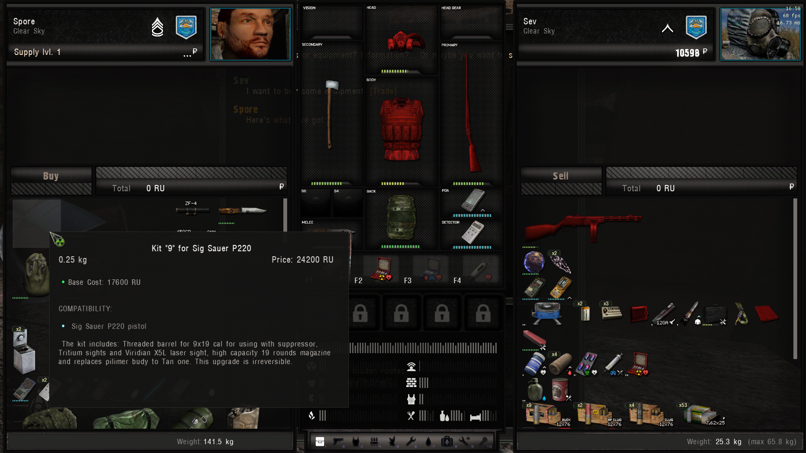
- 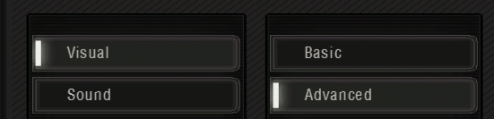
- 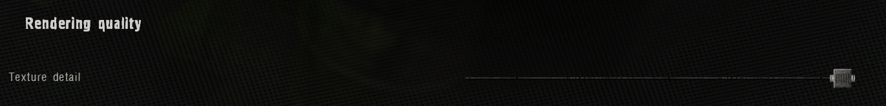

# WHAT TO DO WHEN YOU'RE MISSING SOME SPECIFIC MODS

This guide is for people who are missing a specific mod/mods or have the mod/mods but missing some files. If you're here, it's because WE SENT YOU HERE.

- Dux's Innemurable Characters Kit (mod 29 and 30)
- DLTX (mod 196 and 197)
- AUGmented - The AUG Pack (mod 233/243 or both)
- Dynamic Anomalies Overhaul (mod 234)
- Body Awareness (mod 236)
- Literally any missing mods you can imagine, this guide probably covers that as well

1) Grab the new installer if you don't have it, version 3.8: [G.A.M.M.A._Installer.exe.7z](./assets/G.A.M.M.A._Installer.exe.7z) 
2) Manually download the mod(s) you're missing from Moddb
3) Open your G.A.M.M.A. folder
4) Open downloads
5) Paste the zip(s) file(s) you just downloaded in this folder
   5.1) If you already have the same zip you just downloaded, delete the OLD zip first and move in the NEW one
6) Open the installer with admin rights
7) Click on Download GAMMA data and then on Full GAMMA installation 


# HAVING PROBLEMS WITH Download G.A.M.M.A. data

## First method:

1) Go in here: GAMMA RC3\.Grok's Modpack Installer
2) Delete a file called version.txt
3) Open the installer with admin rights
4) Press again Download GAMMA data

## Second method: - if you're really desperate

1) Download this: https://github.com/Grokitach/Stalker_GAMMA/blob/main/G.A.M.M.A/modpack_data/modlist.txt (you basically need to create a .txt file called modlist)
2) Go in here: GAMMA RC3\Grok's Modpack Installer\G.A.M.M.A\modpack_data
3) Paste the .txt file in this folder
4) Open the installer with admin rights
5) Click on Full G.A.M.M.A. Installation, you don't need to press Download G.A.M.M.A. data since you already have the latest file 

# EXPLAINING WHAT EVERY SETTING DOES IN "VIDEO"

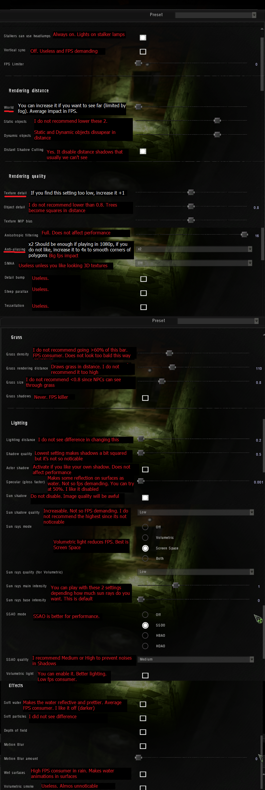

# THE INSTALLER DIDN'T CREATE A SHORTCUT


1) Open your G.A.M.M.A. folder.
2) Scroll down until you'll find ModOrganizer.exe. (check pic)
3) Right click on it and create a shortcut.
4) Put the shortcut on the desktop.
   Done.

-Optional GAMMA icon- we also have a video for it, thanks to @strelok

After you put the shortcut on the desktop:

1) Right click on it
2) Choose Properties, then Choose icon
3) Go inside here: GAMMA RC3\.Grok's Modpack Installer\G.A.M.M.A\modpack_data
4) Select modpack_icon.ico
   Done. 

[video](./assets/mo-shortcut.webm)

# HOW TO DISABLE CORE 0 

First method: (NOTE: This software involves a third party software but it's COMPLETELY Open Source, available publicly on Github.)
Steps are as follow, check pic attached to see how the program looks like:

1) Download "Process Hacker" from Sourceforge or Github: https://processhacker.sourceforge.io/nightly.php (this is the main site) and install it.
   It's a "nightly" build because it contains what we need, a proper way to save the affinity. The version I'm personally using is: 3.0.4953
2) Run Process Hacker as administrator (there is a setting to make it always run as admin, as well as make the default task manager Process Hacker)
3) Run S.T.A.L.K.E.R. Anomaly as normal.
4) Right click on AnomalyDX(yourDXversionhere).exe
5) Hover over "Affinity"
6) Click "Set Affinity"
7) Uncheck Core 0 and click on "OK"
8) Right click again, go back to Affinity and check "Save for AnomalyDX(YourDXversionhere).exe", by doing so, you will never have to set the affinity again. Of course, the program must be opened before Anomaly.

Done.

Bonus: you can enable dark mode if you want.
1) Click on Options
2) Scroll to the right
3) You'll find "Enable theme support (experimental)", enable it

Done.

Second method: https://winbuzzer.com/2020/07/03/how-to-set-cpu-affinity-in-windows-10-with-task-manager-or-system-properties-xcxwbt/

You can use this if you don't like the idea of using a program, this is pretty much doable also with Windows Task Manager.

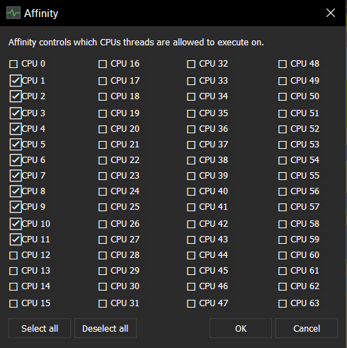

# if you are trying to change your goodwill with a certain faction using debug:

debug mode must be active. see the linked message for the debug mode guide [Debug Mode](#debug-mode)

open the debug menu by pressing f7, then press 0 on the keyboard and type the following command: 
```
relation_registry.set_community_goodwill( "faction name", AC_ID, # )
```

faction names are: 
- `stalker` (loners)
- `killer` (mercenaries)
- `dolg` (duty)
- `army` (military)
- `ecolg` (ecologists)
- `greh` (sin)
- `isg` (UNISG)
- `renegade` 
- `bandit`
- `csky` (clearsky)
- `monolith`

number is the amount of goodwill and it can range from 0 to 3000, but the maximum supply level from traders is at 2000 (level 5)

or you can install https://www.moddb.com/mods/stalker-anomaly/addons/reputation-editor onto your modlist using mo2 to edit player goodwill and faction relations through mcm

# what suits and armors can be exchanged by talking to my faction's main trader

https://docs.google.com/spreadsheets/d/1r9V1Sccdi-_fNy-fHsWB48WZdXO_Sz-JVjy9bzwaXwk/edit?usp=sharing

# HOW DO I EVEN MAKE PROGRESS IN THIS MODPACK, WHAT DO I DO?

This is a comprehensive visual flowchart showing how to make progress, and how the gameplay loop/logic works.

Any players having questions about repairs of firearms or outfits should read APART in this FAQ as well.

This guide also assumes you are familiar with looting, disassembling, crafting, and inventory management.

Remember to Open Original, zoom in, and ctrl+scroll to fit width to your screen.


# HOW TO LAUNCH GAMMA FROM STEAM

1) Open Steam, in your LIBRARY tab, press "ADD A GAME" (first pic)
2) Press "Add a Non-Steam Game" (first pic)
3) Press "BROWSE..." (second pic)
4) Go to your G.A.M.M.A. RC3 folder and direct Steam to your ModOrganizer.exe (third pic)
5) Press "Add Selected Programs"

- 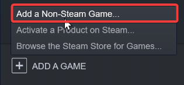
- 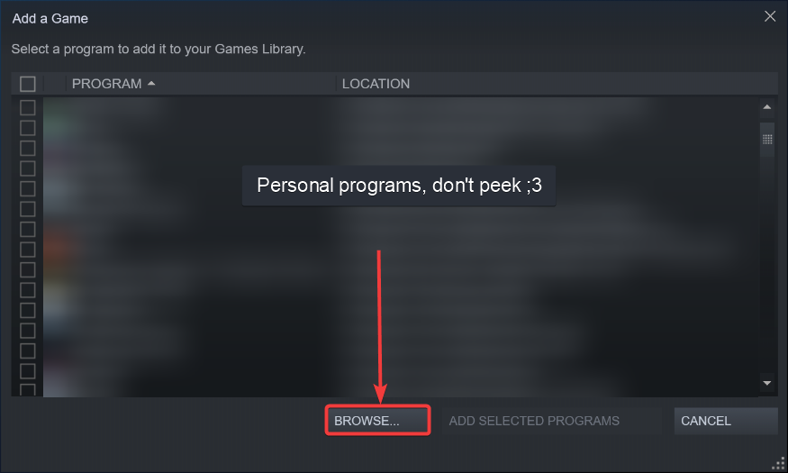
- 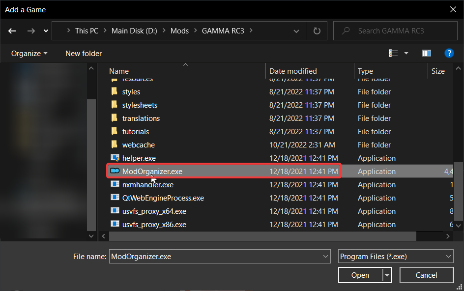

# G.A.M.M.A. in VR

https://youtu.be/8cHViSbjukI

# WHY CAN'T I KILL ANYONE WITH GUNS!?!? IT'S 100% CONDITION!!!

Check which ammo type you're using.
- HP and Buckshot are for mutants, if you use AP against mutants they may over-penetrate and deal less damage.
- AP works best against armoured NPCs. Buckshot and HP might only stun them momentarily at best.
- FMJ is somewhere in-between, when your foe is lightly armoured it works well for saving AP ammo.

Next you check your weapon details:
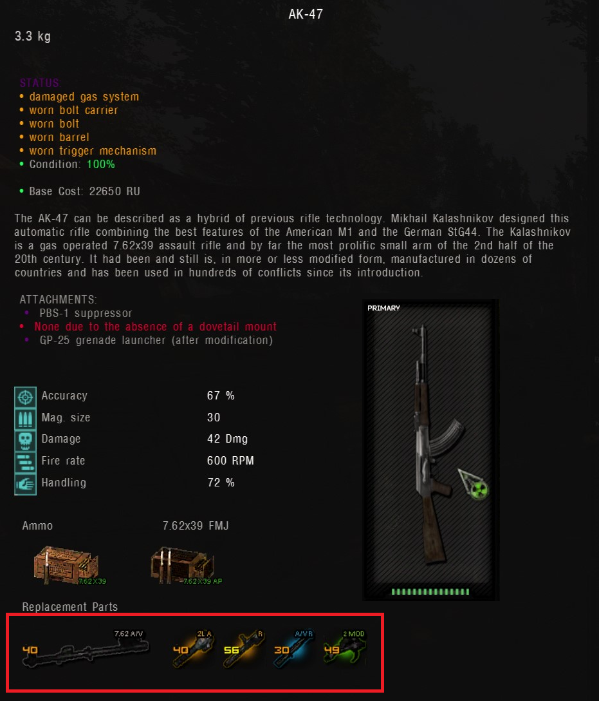
The worse condition your parts are, the less effective your firearm is.

## Is it better to use AP ammo against high tier armored Sinners?

Yes, BUT that is dependent on which ammo. x54r AP or .338 LM cannot actually be fully stopped by the shield as the bullets are too fast, and too powerful, so you get a damage bonus for that.
Outside of those two, it really just depends on what armor they are wearing. Same rules apply as other stalkers, but more bullets are needed.

## Does BR % work after BR rank penetrated or if not penetrated? What is the difference between BR Class and BR %?

BR Class is basically "will it stop the bullet or not". If not, then BR % reduces the damage of that bullet.

## What happens with AP bullet that cannot penetrate?

It does damage to the NPC armor, once the armor damage exceeds the armor value, then the armor section "breaks" and they no longer have armor in that spot.
For players, it does a very small amount of damage. They are different because we can not "unbreak" the armor.

## What "breaks" armor better: HP or AP?

The size of the bullet makes a difference, but typically AP is the fastest at breaking armor, excluding a few very niche cases.

## Does AP penetration reduces when shooting at Sinners?

No, the penetration does not change, however, the damage applied does

# HOW DO I REACH THIS STASH/GET THROUGH THIS AREA?

Short, non-commentary videos on how to reach that Agroprom tree stash, and get through the Wild Territory burner tunnel, and more. (More videos to come due to upload limit)

https://youtube.com/playlist?list=PLEYzg90BwsB5Pa4CnSyj9LjVmIpLtgaQO

# CAN'T COMPLETE "CALL FROM THE NORTH"

Original thread, solution provided by Acemax: https://www.moddb.com/mods/stalker-anomaly/forum/thread/living-legend-call-from-the-north-quest-failedrc22

Stand near the location where Gatekeeper usually is (at the hill camp overlooking the Barrier) and press F7 then Object Spawner. Type stalker_gatekeeper in Spawn by Section and tick the Spawn at player, then click Spawn.

Target Gatekeeper before he wanders off and press F7, then Logic/Execute: Type the following in each field then click Set Logic.

```
Active Section = beh@stalker_gatekeeper
Active Logic = logic@stalker_gatekeeper
INI Filename = scripts\military\stalker_gatekeeper.ltx
```

Save and reload to get him back to his original state.

EDIT: It appears that the corpse of Gatekeeper will despawn and the info portion that he is dead will be added to your save.

When you have spawned a new Gatekeeper and set his logic, use the Function executor at the bottom and type the following with no spaces and click execute:

```
db.actor:disable_info_portion("stalker_gatekeeper_dead")
```

Then go to Barkeep or Aslan and Call from the North will update. 

# I WANT TO PLAY IN DX8 BECAUSE I HAVE A POTATO PC, IS THAT OKAY?

Yes you can, you just need to disable these mods (check pics). This will let you use vanilla NVGs.

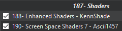
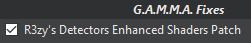
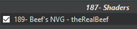
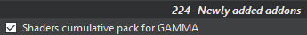
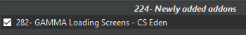

# I WANT TO DELETE EVERYTHING

For Anomaly

If you need to delete your Anomaly folder, make sure to save your save files, because they're inside this folder.

1) Go here: Anomaly\appdata, you'll find a folder called savedgames, make a backup of this folder.
2) Then, extract Anomaly again
3) Move the savedgames folder back inside Anomaly\appdata
4) Update to 1.5.2
5) Launch it once

For G.A.M.M.A.

Already downloaded any mods through the installer? (if you didn't, go on to the next section)

1) Open your GAMMA folder
2) Move the "downloads" folder you can find in there somewhere safe, because this folder contains the zipped mods the installer download and install for you
3) Delete the entire GAMMA folder (make sure the "downloads" folder is safe)
4) Extract GAMMA again, move the "downloads" folder back inside again
5) Open the installer with admin rights
6) Follow the pic below, it will ask you where do you keep Anomaly, choose the location, close MO2 when you're done, press Download G.A.M.M.A. data, wait for it to finish, press Full G.A.M.M.A. Installation.

Didn't download anything yet?

1) Delete the entire GAMMA folder
2) Extract it again
3) Open the installer with admin rights
4) Follow the pic below
5) Click on 1., then on 2., it will ask you where do you keep Anomaly, choose the location
6) Close MO2 when you're done
7) Press Download GAMMA data, wait for it to finish, press Full GAMMA Installation

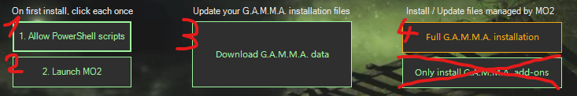

# HOW TO "RESURRECT" SPECIFIC NPCs

You'll need to enable and use debug mode for this one: [Debug Mode](#debug-mode)

The two pics are basically "what you need to click after you press F7" and "what to do in order following the text guide".

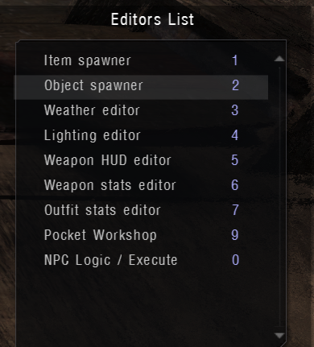
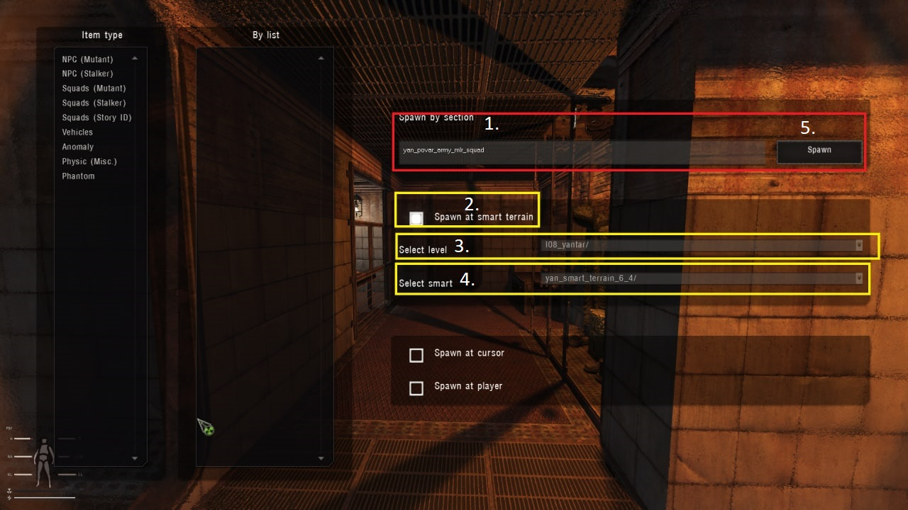

Open Debug Menu with F7
Now hit ‘2’ to open the Object Spawner
Ignore the tabs on the left, the boxes on the right is where you will be working.


Example of NPC Spawn: All spawns will follow this format
Person’s name ( Faction Job - Location )
Spawn by section: Put in the debug spawn in section area, large box at the top


Make sure the box “Spawn at Smart Terrain” is Filled in.
Select level: Choose from drop-down menu
Select Smart: Choose from drop-down menu after choosing level

## Limitations

The general rule of thumb is, you can only spawn unique NPCs. NPCs spawned by the game with random name can not be spawned to achieve the goal you're aiming to, even if they're part of a que
st
(unless they have a unique name, which is only allocated to story quest NPCs). You can spawn the same type of that NPC, or even the NPC with the same look/model, but you can't spawn the exac
t NPCs
with the same name & memories of the missing/dead ones you're trying to replace. That's the cold hard truth.


The only reason said guide only covers the stationary, unique NPCs but not the quest-related ones (yet) are simple:

You have to initiate the quest to get their ID

Some quest NPCs belong to addons and are not available in the base Anomaly so we don't know where to dig to get their spawn ID.

These NPCs have different unique IDs at different stages of the same quests.

I find it funny, that some people actually try to spawn back their non-unique companions then bitch about the fact this guide doesn't help (fucking duh). I mean, can't you just reload a save
where they were still alive?
Your companion is just about as important (not) as your character in the Zone. They don't matter. You can always find a new one to fill in their role.

Also, regarding quest NPCs that don't have unique IDs, like the captain at the Pump Station in Clear Sky's Daily Quest, that quest is known to be buggy. The rule of thumb is, make a save bef
ore taking a quest
No not the quick save, but a named save. Also, you can change the option in the game to enable up to 20 quick save files, you won't regret it.

Another possible solution for this is to reload a save where the quest is still active and not initiated (the captain is not talked to, yet he's gone), try this spawn command:

`drx_march_task_5_csky_squad` (Select "spawn at player" while being at the pump station)

This will spawn a whole squad of Clear Sky, and they look like the squad waiting for you at the station for this quest.

<details>
<summary>
Spawners
</summary>

```
CORDON


Xenotech (Loner Tech - Cordon Farm)
Spawn by section: esc_smart_terrain_5_7_loner_mechanic_stalker_squad
Select level: l01_escape
Select Smart: esc_smart_terrain_5_7/


Xenotech Trader (Loner Trader - Cordon Farm)
Spawn by section: escape_main_base_trader_mlr
Select level: l01_escape
Select Smart: esc_smart_terrain_5_7/


Fanatic (Loner Rookie Tutorial - Cordon)
Spawn by section: esc_2_12_stalker_fanat_squad
Select level: l01_escape
Select Smart: esc_smart_terrain_2_12/
(Will take a second to walk to his spot from bunker)


Hip (Companion - Cordon)
Spawn by section: devushka_squad
Select level: l01_escape
Select Smart: esc_smart_terrain_2_12/


Wolf (Loner Quest Giver - Cordon )
Spawn by section: esc_2_12_stalker_wolf_squad
Select level: l01_escape
Select Smart: esc_smart_terrain_2_12/


Sidorovich (Fat bast- I mean Loner General Trader - Cordon )
CANNOT BE RESPAWNED. He isn't human, like, literally. He's a talking box and he shouldn’t disappear for ANY reason.
If somehow he does… run… he’s coming…


/---/


GREAT SWAMPS


Novikov (Clear Sky Tech - Great Swamp)
Spawn by section: mar_base_stalker_tech_squad
Select level: k00_marsh
Select Smart: mar_smart_terrain_base/


Spore (General Merchant - Great Swamp)
Spawn by section: mar_base_owl_stalker_trader_squad
Select level: k00_marsh
Select Smart: mar_smart_terrain_base/


Cold (Clear Sky Leader - Great Swamp)
Spawn by section: mar_smart_terrain_base_stalker_leader_marsh_squad
Select level: k00_marsh
Select Smart: mar_smart_terrain_base/


Professor Kalancha (Clear Sky medic - Great Swamp)
Spawn by section: mar_doctor_squad
Select SPAWN AT CURSOR and look at his chair


Librarian (Clear Sky Bartender -  Great Swamp)
Spawn by section: mar_base_stalker_barmen_squad
Select level: k00_marsh
Select Smart: mar_smart_terrain_base/

Swamp Doctor (Clear Sky - Great Swamp)
Spawn by section: mar_smart_terrain_doc_doctor
Select level: k00_marsh
Select Smart: mar_smart_terrain_doc


/---/


GARBAGE


Butcher (Neutral Mutant Trader - Garbage)
Spawn by section: hunter_gar_trader_squad
Select level: I02_garbage/
Select Smart: gar_smart_terrain_3_5/


Flea Market Traders (Neutral Traders - Garbage )
Spawn by section: stalker_sim_baraholka_traders
Select level: I02_garbage/
Select Smart: gar_smart_terrain_6_3/
-SPAWNS BOTH TRADERS: If one is alive, delete first using debug before spawning-


/---/


AGROPROM:


Colonel Kuznetsov (Military Leader - Research Institute)
Spawn by section: agr_smart_terrain_1_6_near_2_military_colonel_kovalski_squad (Just re-type what you see in the Select Smart option for this, without the "/", then add "_military_colonel_kovalski_squad")
Select level: I03_agroprom/
Select Smart: agr_smart_terrain_1_6_near_2/


Senior Lieutenant Kirilov (Military Mechanic - Research Institute)
Spawn by section: agr_smart_terrain_1_6_army_mechanic_stalker_squad
Select SPAWN AT PLAYER (Just stand where he should be - behind his vice- he will spawn right there)


Lieutenant Rogovets (Military Medic - Research Institute)
Spawn by section: agr_1_6_medic_army_mlr_squad
Select level: I03_agroprom/
Select Smart: agr_smart_terrain_1_6/


Commander (Military Food Merchant - Research Institute)
Spawn by section: agr_1_6_barman_army_mlr_squad
Select level: I03_agroprom/
Select Smart: agr_smart_terrain_1_6/


Sergeant Spooner (Military General Merchant - Research Institute)
Spawn by section: agr_smart_terrain_1_6_army_trader_stalker_squad
Select level: I03_agroprom/
Select Smart: agr_smart_terrain_1_6/


DARKVALLEY:

Limpid (Bandit Mechanic - Bandit Base)
Spawn by section: val_smart_terrain_7_3_bandit_mechanic_stalker_squad
Select level: I04_darkvalley/
Select Smart: val_smart_terrain_7_3/


Olivius (Bandit General Trader - Bandit Base)
Spawn by section: val_smart_terrain_7_4_bandit_trader_stalker_squad
Select level: I04_darkvalley/
Select Smart: val_smart_terrain_7_3/


Olivius (Bandit General Trader - Bandit Base)
Spawn by section: val_smart_terrain_7_4_bandit_trader_stalker_squad
Select level: I04_darkvalley/
Select Smart: val_smart_terrain_7_3/


Pug (Bandit Guide - Bandit Base)
Spawn by section: guid_dv_mal_mlr_squad
Select level: I04_darkvalley/
Select Smart: val_smart_terrain_7_5/
NOTE: This guy will take a bit to get to where he should be since he spawns near the entrance to the base (where Sultan is)


Andyuha (Bandit Medic - Bandit Base)
Spawn by section: bandit_main_base_medic_mlr_squad
Select level: I04_darkvalley/
Select Smart: val_smart_terrain_7_5/
NOTE: This guy will take a bit to get to where he should be since he spawns near the entrance to the base (where Sultan is). Also, his last name is random, while his first name is always Andyuha


Sultan (Bandit Boxx - Bandit Base)
Spawn by section: zat_b7_bandit_boss_sultan_squad
Select level: I04_darkvalley/
Select Smart: val_smart_terrain_7_5/


Pirogov (Ecologist Artifact Hunter Quest Character - Abandoned Pig Farm)
Spawn by section: ah_dark_pirogov_squad
Select level: I04_darkvalley/
Select Smart: val_smart_terrain_4_0/

/---/


YANTAR


Spirit (Ecologist Bartender  - Yantar)
Spawn by section: yan_povar_army_mlr_squad
Select level: I08_yantar/
Select Smart: yan_smart_terrain_6_4/


Peregrine (Ecologist Mechanic - Yantar)
Spawn by section: mechanic_army_yan_mlr_squad
Select level: I08_yantar/
Select Smart: yan_smart_terrain_6_4/


Kruglov (Ecologist Quest Character - Yantar)
Spawn by section: yan_ecolog_kruglov_squad
Select level: I08_yantar/
Select Smart: yan_smart_terrain_6_4/


Vasilyev (Ecologist Quest Character - Yantar)
Spawn by section: yan_ecolog_vasilyev_squad
Select level: I08_yantar/
Select Smart: yan_smart_terrain_6_4/


Semenov (Ecologist Trader - Yantar)
Spawn by section: yan_ecolog_semenov_squad
Select level: I08_yantar/
Select Smart: yan_smart_terrain_6_4/


Saharov (Ecologist Quest Character  - Yantar)
Spawn by section: yan_stalker_sakharov_squad
Select level: I08_yantar/
Select Smart: yan_smart_terrain_6_4/


/---/


ROSTOK


Magnum (Duty Tech - Rostok)
Spawn by section: bar_visitors_cardan_tech_squad
Select level: I05_bar/
Select Smart: bar_visitors/


Arena Manager (Loner Arena - Rostok)
Spawn by section: Bar_arena_manager_squad
Select level: I05_bar/
Select Smart: bar_visitors/


Snitch (Faction Relations - Rostok)
Spawn by section: bar_informator_mlr_squad
Select level: I05_bar/
Select Smart: bar_visitors/


Barkeep (Duty Barkeep - Rostok)
Spawn by section: bar_visitors_barman_stalker_trader_squad
Select level: I05_bar/
Select Smart: bar_visitors/

Navigator (Loner Guide - Rostok)
Spawn by section: guid_bar_stalker_navigator_squad
Select SPAWN AT PLAYER (Just stand where he's supposed to be and hit Spawn. Works the very first time. NOTE: This will only work if the original Navigator is dead/missing)
This is the newly discovered 3rd method to spawn NPC that can't otherwise be spawned using my method (spawn at smart terrain) or Irwhittaker (spawn at cursor). Other NPCs might be spawned in using this.


Colonel Petrenko (Duty General Trader - Rostok)
Spawn by section: bar_dolg_general_petrenko_stalker_squad
Select level: I05_bar/
Select Smart: bar_dolg_general/


Aspirin (Duty Medic - Rostok)
Spawn by section: dolg_medic_squad
Select SPAWN AT CURSOR and look at his spot


General Voronin (Duty Leader - Rostok)
Spawn by section: bar_dolg_leader_squad
Select level: I05_bar/
Select Smart: bar_dolg_bunker/


/---/


ARMY WAREHOUSES


Solid (Freedom Medic - Army Warehouses)
Spawn by section: mil_freedom_medic_squad
Select SPAWN AT CURSOR while aiming AT his table.
Works ⅓ times, keep trying and reloading till it does
NOTE: Irwhittaker's method has 100% success rate. Solid will spawn outside of the barrack where he's supposed to be, right next to the T-64 tank in the middle of the base. He will start walking towards the barrack
then clips through it as soon as he reaches the first window that isn't boarded up. Just press "/" to open your mini map. If you see the mechanic icon (Solid) moving towards you, he has been spawned properly.


Lukash (Freedom Leader - Army Warehouses)
Spawn by section: mil_smart_terrain_7_7_freedom_leader_stalker_squad
Select level: l07_military
Select Smart: mil_smart_terrain_7_7/


Leshiy (Freedom Guide - Army Warehouses)
Spawn by section: mil_freedom_guid_squad
Select level: l07_military
Select Smart: mil_smart_terrain_7_7/


Screw (Freedom Mechanic - Army Warehouses)
Spawn by section: mil_smart_terrain_7_7_freedom_mechanic_stalker_squad
Select level: l07_military
Select Smart: mil_smart_terrain_7_7/


Skinflint (Freedom General Trader - Army Warehouses)
Spawn by section: mil_smart_terrain_7_10_freedom_trader_stalker_squad
Select SPAWN AT CURSOR while aiming NEXT TO his table.


Gatekeeper (Quest Loner - The Barrier in Army Warehouses)
Spawn by section: stalker_gatekeeper_squad
Select level: l07_military
Select Smart: mil_smart_terrain_4_8/


/---/


DEAD CITY

Dushman (Merc's Merchant - Dead City)
Spawn by section: cit_killers_merc_trader_stalker_squad
Select level: l09_deadcity
Select Smart: cit_killers


Hog (Merc's Mechanic - Dead City)
Spawn by section: cit_killers_merc_mechanic_stalker_squad
Select level: l09_deadcity
Select Smart: cit_killers


Aslan (Merc's Food Merchant - Dead City)
Spawn by section: cit_killers_merc_stalker_aslan_squad
Select level: l09_deadcity
Select Smart: cit_killers


Leopard (Merc's Guide - Dead City)
Spawn by section: ds_killer_guide_main_base_squad
Select level: l09_deadcity
Select Smart: cit_killers


Surgeon (Merc's Medic - Dead City)
Spawn by section: cit_killers_merc_medic_stalker_squad
Select level: l09_deadcity
Select Smart: cit_killers


/---/


JUPITER:


Garry (Loner Guide - Jupiter Station)
Spawn by secion: guid_jup_stalker_garik_squad
Select SPAWN AT PLAYER (Just stand by the table where he usually stands - the one in the corner near the western exit, next to a pile of wooden crates)


Hawaiian (Freedom's Food Merchant - Jupiter Station)
Spawn by section: jup_a6_stalker_barmen_squad
Select level: jupiter/
Select Smart: jup_sim_6/


Loki (Freedom Leader - Juipiter Station)
Spawn by section: jup_a6_freedom_leader_squad
Select level: jupiter/
Select Smart: jup_sim_6/


Bonesetter (Loner Medic - Jupiter Station)
Spawn by section: jup_a6_stalker_medik_squad
Select level: jupiter/
Select Smart: jup_sim_6/


Ashot (Freedom Merchant - Jupiter Station)
Spawn by section: jup_a6_freedom_trader_ashot_squad
Select level: jupiter/
Select Smart: jup_sim_6/


Trapper (Loner Hunter - Jupiter Station)
Spawn by section: jup_b25_alex_squad
Select level: jupiter/
Select Smart: jup_sim_6/


Nitro (Loner Technician - Jupiter Station)
Spawn by section: jup_b10_stalker_drunk_squad
Select level: jupiter/
Select Smart: jup_sim_6/


Cardan (Loner Chief Technician - Jupiter Station)
Spawn by section: jup_a6_kardan_squad
Select level: jupiter/
Select Smart: jup_sim_6/


Hermann, Ozersky & Tukarev (Ecologist Scientists - Scientist Bunker)
Spawn by section: jup_b6_scientist_group
Select level: jupiter/
Select Smart: jup_b47/
NOTE: The command will spawn all 3 of these guys. So if one of them is dead/missing, make sure to kill the rest using debug menu (press K while looking at them), before spawning.


Klenov (Bandit Merchant - Container Warehouse)
Spawn by section: jup_cont_trader_bandit_squad
Select level: jupiter/
Select Smart: jup_a12/
NOTE: He will spawn outside of the warehouse and slowly walks back in


Nile (Bandit Technician - Container Warehouse)
Spawn by section: jup_cont_mech_bandit_squad
Select level: jupiter/
Select Smart: jup_a12/
NOTE: He will spawn outside of the warehouse and slowly walks back in


ZATON:


Scar (Loner Quest Character Of Clear Sky Questline - Workshop Station)
Spawn by section: dragun_squad
Select level: zaton/
Select Smart: zat_b103_merc_smart/
NOTE: spawning Scar using "spawn at smart terrain" will make sure he will spawn at the station in Zaton, REGARDLESS of where the player is in the Zone.
Or you can choose to spawn him using "spawn at player" or "spawn at cursor" instead (no need to select the "level" and "smart"), but you must physically be at that station by the time you spawn him in
else he will try to get to his designated spot in the designated map on his own. Things will go wrong and he may die along the way.

Props to whoever came up with the spawn command for this, I didn't. I only added in the "Selet level" & "Select smart" to make sure players can spawn Scar back in wherever they are in the Zone
(without having to physically be at the Workshop Station where Scar is) - Marshall.


Kolin (Merc Mechanic - Waste Processing Plant)
Spawn by section: zat_stancia_mech_merc_squad
Select level: zaton/
Select Smart: zat_b40_smart_terrain/


Vector (Merc Merchant - Waste Processing Plant)
Spawn by section: zat_stancia_trader_merc_squad
Select level: zaton/
Select Smart: zat_b40_smart_terrain/


Pilot (Loner Guide - Skadovsk)
Spawn by section: guid_zan_stalker_locman_squad
Select level: zaton/
Select Smart: zat_stalker_base_smart/


Beard (Loner Food Merchant - Skadovsk)
Spawn by section: zat_b22_barmen
Select level: zaton/
Select Smart: zat_stalker_base_smart/


Owl (Loner General Merchant - Skadovsk)
Spawn by section: zat_b30_owl_stalker_trader_squad
Select level: zaton/
Select Smart: zat_stalker_base_smart/


Axel (Loner Medic - Skadovsk)
Spawn by section: zat_b22_medic
Select level: zaton/
Select Smart: zat_stalker_base_smart/


Spleen (Loner Mechanic - Skadovsk)
Spawn by section: zat_tech_mlr
Select level: zaton/
Select Smart: zat_stalker_base_smart/


Nimble (Loner Gun Merchant - Skadovsk)
Spawn by section: zat_a2_stalker_nimble_squad
Select level: zaton/
Select Smart: zat_stalker_base_smart/


Gonta (Loner Hunter - Skadovsk)
Spawn by section: zat_b106_stalker_gonta_squad
Select level: zaton/
Select Smart: zat_stalker_base_smart/
```
</details>

# HOW TO ENABLE AND USE MAID'S ICONS

1) Right click 193- Maids HD Icons (right click and reinstall if you want to use it) - Maids
2) Choose Reinstall
3) Pick the first and third options (first pic)
4) Proceed with Next and select All in One Option (second pic)
5) inb4 "do I need to enable DII?" - No.

It should be good like this, this isn't my guide, another user made it, I'm just posting it here.

AUG variants are not visible in icons anymore.

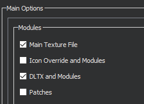
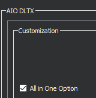
