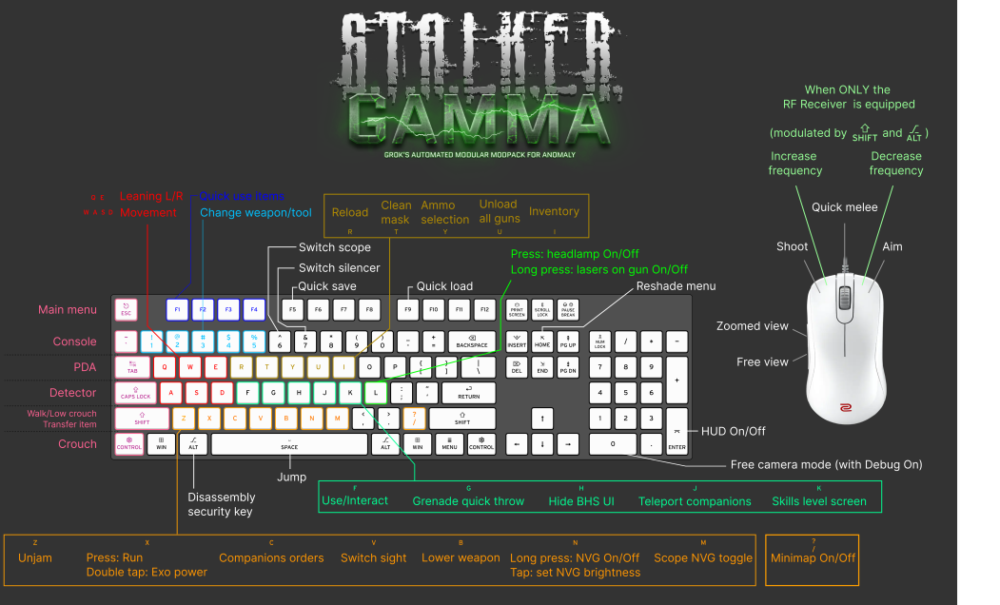

- Pressing R with the PDA in hands will put it away, allowing you to see the surroundings. This can be used to display the minimap while moving around without having to rely on the minimap in the top left corner
- Pressing LAlt in inventory before hovering an item will display the item with max stats (as if condition was 100%) (G.A.M.M.A. Full Condition Displayer) 
- Regarding the "display the item with max stats" button, it's Left Ctrl now, not Left Alt.
- V can also be used for underbarrel grenade launcher.
- Z is now used to tear patches off or reattach patches to your current armor

  R is used to unjam and reload guns depending on the situation > can't shoot ? Press R.
