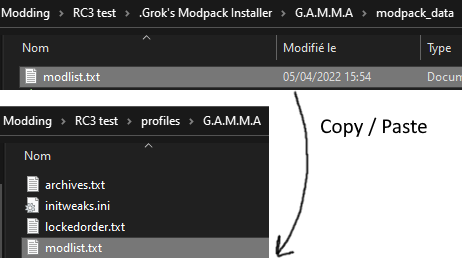
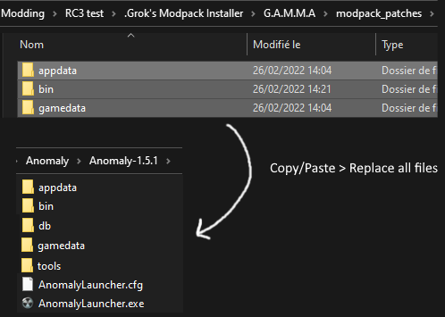

# Troubleshooting

NUMBER ONE RULE:


WHEN IN DOUBT, OPEN CONSOLE > type save > enter > Esc > Load your last save

## During the install process:

- When in doubt, reinstall once again (delete mods folder > launch the installer > complete install)

- if you crash on startup of Anomaly, try replacing the exe of Anomaly (in Anomaly/bin) by the ones of the GAMMA (in GAMMA RC1/.Grok's Modpack Installer/GAMMA/modpack_patches/bin).

- If you play in DX8, delete the appdata/user.ltx in Anomaly folder can avoid some crash on startup.

- If some addons have a red cross, you can right click > reinstall them (shouldn't happen).

- Addons newly updated compared to modpack definition will be stored at the end of the load order in MO2 so you can easily spot them. Double click them to see if there's a gamedata folder in theses addons, if it's the case, you can then move them to their correct position thanks to the number in their name (i.e. 83- for the 83th addon of the load order) and launch the game. If the game crashes or if there is no gamedata folder in these addons, you can right click > reinstall them.

- If you don't have windows 10, you need to install PowerShell 5 https://www.microsoft.com/en-us/download/details.aspx?id=54616

- Windows Defender can flag the installer as a virus (others might flag it as a ransomware...). You can scan it online here (https://www.virustotal.com/gui/home/upload) if you don't trust the exe file, these are indeed false alarm of few antivirus. You need to add the exe as an exception if it's self deleting. Here's the virus total scan result for the installer: https://www.virustotal.com/gui/file/e9b09b8abeb263f89cd39448cf48be272ab9c32baeed04cd7f734bdc097ddb05/detection

- If you have troubles downloading the files (receiving TSL SSL errors), you can replace the installer in .Grok's Modpack Installer by this one: https://github.com/Grokitach/Stalker_GAMMA/raw/main/G.A.M.M.A.%20Installer.exe 

# GPU device instance has been suspended Fix
aka AMD GPU issues fix

If you have an AMD GPU, different issues can arise, from random crashes to add-ons not working after a small stutter (NVG not working, animations being broken...). If you suspect your AMD GPU being involved, here's an easy fix:

- Go to the anomaly bin folder and force both directx11.exe (AVX and Non AVX) to launch in admin and in the properties disable full screen optimization and dpi overwrite.

Modify the registry entry to increase the GPU processing time.

- Open the windows start menu and type regedit. Click the Registry Editor app to launch it.
- In regedit search GraphicsDrivers under HKEY_LOCAL_MACHINE\GraphicsDrivers or HKEY_LOCAL_MACHINE\SYSTEM\CurrentControlSet\Control\GraphicsDrivers
- After clicking GraphicsDrivers add a new QWORD (64 bit) and name it TdrDelay on the right panel.
- Double click on TdrDelay and add 8 for the value data. You can set it even higher.
- Restart Windows
- Undervolt and underclock your AMD GPU a little bit (using MSI Afterburner for instance)

A possible AMD GPU fix is to check BIOS to make sure the GPU is running on PCI GEN 3. In your BIOS settings you can also go to advanced chipset configuration and ENABLE Above 4G Decoding. 

# Preventing Busy Hands issue

If you have problems with MagsRedux ammo checking locking the hands of your character, or issues after looting mutants do the following:

- In MO2, right click 201–MagsRedux add–on and click Reinstall Mod, in the new window appearing, be sure MagsRedux, EFT Reposition Patch and BaS Patch are ticked then click Install.

- In game, open the Mod Configuration Menu, go to FDDA, and make sure the Pickup Animations and Mutant Looting animations are disabled (light off). 

# Solving the Hard Busy Hands issue that killed a save (very rare)

If you have the dreaded "busy hands" bug (can't interact with anything, saving crashes the game) here's the 100% working fix:

- In MO2, disable Crook's UI Identification, FDDA, immersive sleep, immersive sleep FDDA patch, DLTX FDDA extra animations, GAMMA Cooking overhaul, GAMMA Sleep Balance and GAMMA FDDA Rework

- Load your save, play a little bit normally and save (the bug should be gone already).

- Quit the game and activate addons you previously disabled.

- Load your last save, the problem should be gone now and all the animations will work as usual. 

# Black and White Flickering screen or total black screen

While in game if everything is black or flickering black and white type in the console:

```
cfg_load grading_warm 
```

# Adjusting how dark the game can be (DX11 only)

While in game, you can adapt how dark the game can be depending on your screen calibration with these two settings
(increasing them will make the screen brighter) by opening the console (check [KEYBINDS.md](./KEYBINDS.md) to know how to open it):

```
contrast
gamma
```

Here's another way to adjust the game brightness

https://youtu.be/-2r0Czvjzg8

#  Grass or ground are washed out / shining / white

If the ground or grass turns white sometimes, try changing the values of the following commands in the console:

```
r2_gloss_factor 0.001
r2_gloss_min 0.5
```

# Some sights / red dots / scopes dot aren't displayed

if you have issues with scopes / sights / red dots actual dot display, keep textures detail above the middle in the game graphics options. 

# The Jar issue

On boot if you have a crash to desktop related to a jar section you need to copy paste the GAMMA RC3/. Grok's Modpack Installer/GAMMA/modpack_patches/ content to the Anomaly folder. 

# Crash because of shaders compilation

Delete Anomaly/appdata/shaders_cache folder.

# Debug Menu doesn't launch

Launch the Anomaly launcher from MO2, tick debug, then launch Anomaly from the launcher by clicking play.

# Installer hangs during Instructions Solving parts

Go to your C:/Windows/System32/Robocopy.exe, copy paste it in GAMMA RC1/.Grok's Modpack Installer/resources. Remove Robocopy_10.exe and rename your recently pasted Robocopy.exe to Robocopy_10.exe, relaunch the installer and it should be fixed.

# Missing vcruntime140_1.dll

Install vcredist 2015-2022 for both x64 and x86

# GAMMA UI displays multiple faction badges

That is because your textures details isn't high enough. If you have issues with textures quality hindering your framerate, consider using the classic textures [FRAMERATE_OPTIMISATION.md](./FRAMERATE_OPTIMISATION.md)

# Can't open section 'string_table'

Delete the following file from your Anomaly folder: gamedata/configs/localization.txt 

# Load order is scrambled

If the trick below doesn't work, you probably have a global MO2 instance and you should remove it, then delete GAMMA RC3/ModOrganizer.ini file. Launch GAMMA RC3/ModOrganizer.exe choose portable instance and show the Anomaly folder.



# Game stutters and have bad Framerate

Removing stutters by turning off core 0 for Anomaly.exe once launched.

Turn off core 0 for Anomaly. CTRL+Shift+ESC while in game. Right click Anomaly process > Details > Set Affinity > Untick core 0. Also, click Priority > High. You can also  check this guide: https://www.makeuseof.com/how-to-manually-allocate-cpu-cores-windows-10/

# Crashing after fresh install despite correct mod count

First things first, check that these files in GAMMA RC3/downloads are of the correct size (image 1 below). If not, download the add-ons manually from moddb and move their zip to the downloads folder.

Then, be sure to copy paste the content of GAMMA RC3/. Grok's Modpack Installer/modpack_patches to the Anomaly folder (image 2 below).

If it still doesn't work, delete the GAMMA RC3/mods folder, delete GAMMA RC3/.Grok's Modpack Installer folder > get that folder back from the GAMMA RC3.7z archive and put it back into your existing GAMMA RC3 folder > Launch installer > update GAMMA data > Complete GAMMA Install. 



# take_item_anim.script:35: attempt to perform arithmetic on a nil value

Delete take_item_anim.script and enhanced_animation.script in G.A.M.M.A. Cooking Overhaul/gamedata/scripts Addon (double click it in MO2 > Open mod in explorer top left button) .
Also delete these two scripts  in GAMMA RC3/.Grok's modpack installer/modpack_addons/G.A.M.M.A. Cooking Overhaul/scripts folder 

# FOV is not resetting after shooting / free zoom.

Simply change the FOV slider in the option menu back to what you like. It can rarely happen. 

# If your game crashes when talking to traders or on startup about duplicate dialogs XML nodes:

Delete the following folders:

-  GAMMA RC3.Grok's Modpack Installer\G.A.M.M.A\modpack_addons\Grok's and Darkasleif's Armor Exchange\

-  GAMMA RC3\mods\Grok's and Darkasleif's Armor Exchange\

Then Launcher the installer, perform a Update GAMMA Data > Only Install GAMMA addons.

This will  fix your issue 
